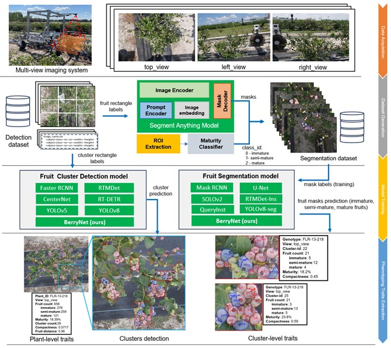
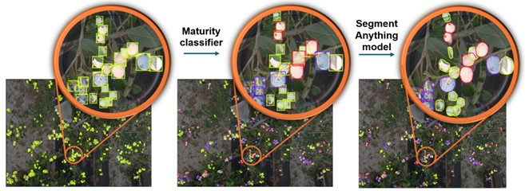
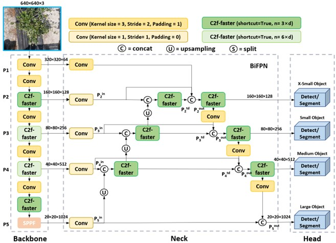

# BerryNet
Enhancing In-Field Robotic Blueberry Fruit Phenotyping: Customized BerryNet Through Learning Pixel-wise Labels from Segment Anything Model (SAM)

The repository is for the paper: Enhancing In-Field Robotic Blueberry Fruit Phenotyping: Customized BerryNet Through Learning Pixel-wise Labels from Segment Anything Model (SAM), including the code and dataset for reproducing. 


## Pipeline of DT/MARS-CycleGAN

Fig. 1: Diagram of the proposed blueberry fruit phenotyping workflow involving four stages: data collection, training dataset generation, model training, and phenotyping traits extraction.


<p align="center">
  
</p>
<p align="center"><i>Figure 2. Illustration of the proposed automated pixel-wise label generation process for blueberry fruits at different maturiety stages. (a) Bounding boxes from a previous detection dataset (Z. Li et al., 2023); (b) Bounding boxes re-classified into three categories: immature (yellow), semi-mature(red), and mature (blue), using a maturity classifier; (c) Pixel-wise mask labels generated using the Segment Anything Model.</i></p>


<p align="center">
  
</p>
<p align="center"><i>Figure 7. Illustration of the BerryNet framework. It incorporated three major enhancements: 1) enhancing P2 layer to better capture features of small objects; 2) implementing BiFPN for improved feature fusion, and 3) replacing C2f block with the more efficient C2f-faster block to accelerate inference. </i></p>


## Prerequisites

[YOLOv8](https://github.com/ultralytics/ultralytics) repository for crop detection;
```
 pip install ultralytics
 pip install pybullet torch accelerate timm
```


## Getting Started
See [GANs](GAN/GAN)


## Dataset Download
The dataset has been released on [Kaggle](https://www.kaggle.com/datasets/zhengkunli3969/dtmars-cyclegan). Also, you can download on [Google Drive](https://drive.google.com/drive/folders/12pb47Zl1j285z5AXG8F77oASkfYqSbA0?usp=sharing).


## Pretrained models
The pre-trained models are available at [weight](weight). All the weights are YOLOv8n trained with different synthesized data.  
    - best.pt: trained with images generated from DT/MARs-CycleGAN (ours).  
    - CYC.pt: trained with  images generated from original CycleGAN.  
    - RetinaGAN.pt: trained with images generated from RetinaGAN.  
    - pure_sim.pt: trained with images generated from Publlet.  

## References
If you find this work or code useful, please cite:

```
@article{liu2023dt,
  title={Dt/mars-cyclegan: Improved object detection for mars phenotyping robot},
  author={Liu, David and Li, Zhengkun and Wu, Zihao and Li, Changying},
  journal={arXiv preprint arXiv:2310.12787},
  year={2023}
}
```
