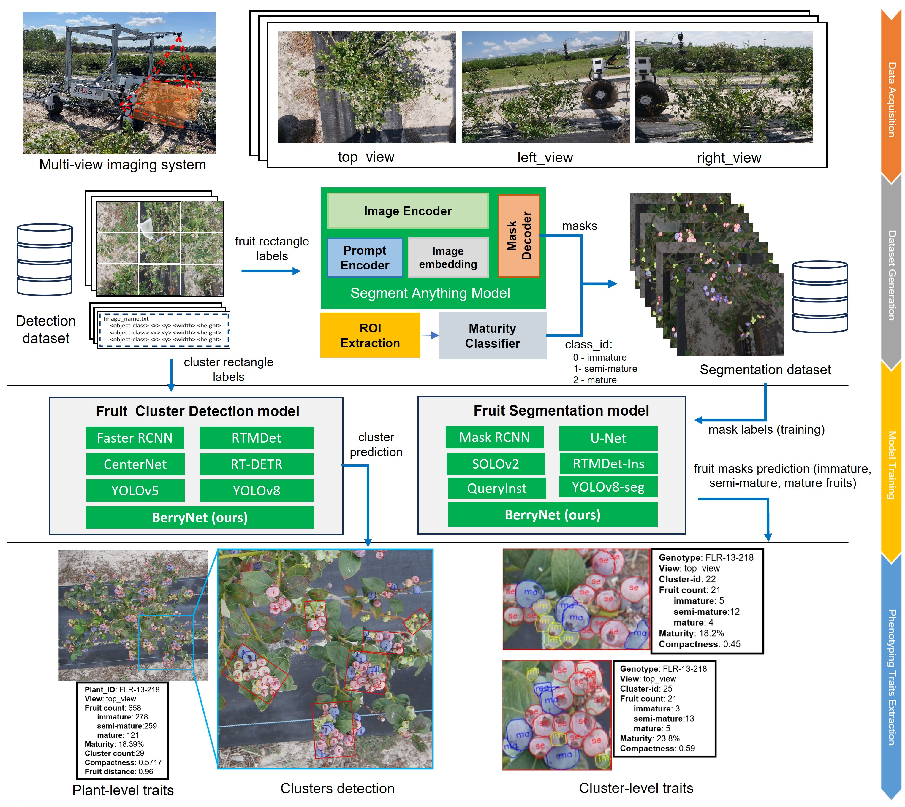
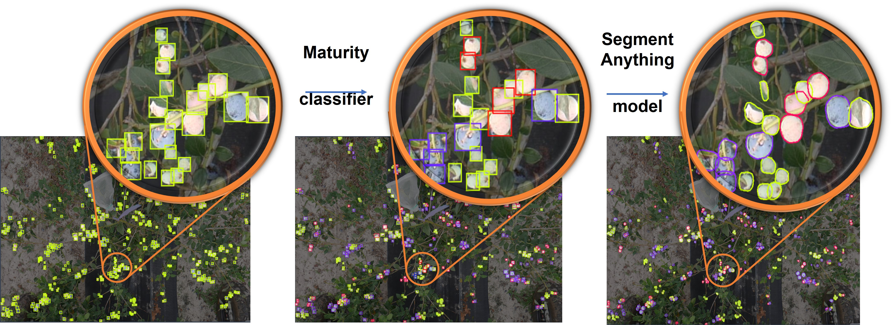
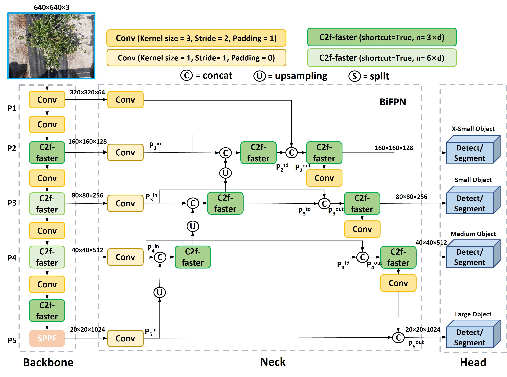

# BerryNet
Enhancing In-Field Robotic Blueberry Fruit Phenotyping: Customized BerryNet Through Learning Pixel-wise Labels from Segment Anything Model (SAM)

The repository is for the paper: Enhancing In-Field Robotic Blueberry Fruit Phenotyping: Customized BerryNet Through Learning Pixel-wise Labels from Segment Anything Model (SAM), including the code and dataset for reproducing. 


## Pipeline of DT/MARS-CycleGAN
<p align="center">
  
</p>
<p align="center"><i>Fig. 1: Diagram of the proposed blueberry fruit phenotyping workflow involving four stages: data collection, training dataset generation, model training, and phenotyping traits extraction.</i></p>

## SAM-based Pixel-wise labeling
<p align="center">
  
</p>
<p align="center"><i>Figure 2. Illustration of the proposed automated pixel-wise label generation process for blueberry fruits at different maturiety stages. (a) Bounding boxes from a previous detection dataset (Z. Li et al., 2023); (b) Bounding boxes re-classified into three categories: immature (yellow), semi-mature(red), and mature (blue), using a maturity classifier; (c) Pixel-wise mask labels generated using the Segment Anything Model.</i></p>

## BerryNet Architecture
<p align="center">
  
</p>
<p align="center"><i>Figure 7. Illustration of the BerryNet framework. It incorporated three major enhancements: 1) enhancing P2 layer to better capture features of small objects; 2) implementing BiFPN for improved feature fusion, and 3) replacing C2f block with the more efficient C2f-faster block to accelerate inference. </i></p>


## Prerequisites

[YOLOv8](https://github.com/ultralytics/ultralytics)
```
 pip install ultralytics
```
[Segment Anything Model]([https://github.com/ultralytics/ultralytics](https://github.com/facebookresearch/segment-anything))
```
pip install git+https://github.com/facebookresearch/segment-anything.git
```


## Getting Started
See 


## Dataset Download
This paper released four datasets for comprhensive research of blueberry, which are availiable on kaggle:
  * [Blueberry Fruit Detection](https://www.kaggle.com/datasets/zhengkunli3969/blueberry-detection-dataset)
  * [Blueberry Maturity Classification](https://www.kaggle.com/datasets/zhengkunli3969/blueberry-maturiety-classification)
  * [Blueberry Pixel-wise Segmentation](https://www.kaggle.com/datasets/zhengkunli3969/blueberry-segmentation-with-segment-anything-model)
  * [Blueberry Cluster Detection](https://www.kaggle.com/datasets/zhengkunli3969/blueberry-cluster-detection)


## Pretrained models
The pre-trained models are available at [weight](weight). All the weights are YOLOv8n trained with different synthesized data.  
    - best.pt: trained with images generated from DT/MARs-CycleGAN (ours).  
    - CYC.pt: trained with  images generated from original CycleGAN.  


## References
If you find this work or code useful, please cite:

```
****************************
```
